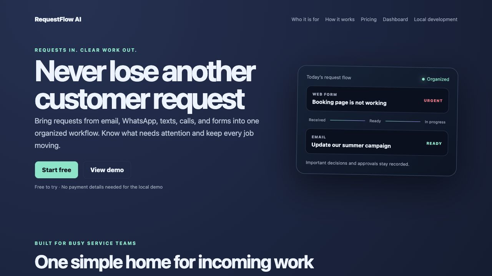
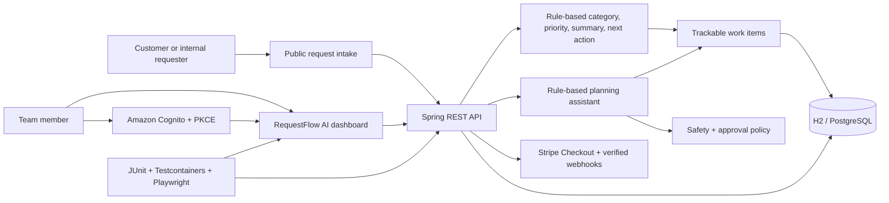

# RequestFlow AI

RequestFlow AI is a production-shaped SaaS MVP foundation for small businesses, agencies,
consultants, and small IT/support teams. It brings incoming requests into one workspace, turns
them into trackable work, helps teams identify urgent items, and preserves an audit trail as the
work moves forward.


[](https://github.com/jmmmdv/FromZeroToHero/actions/workflows/ci.yml)




> **Status:** working SaaS foundation and pilot-ready demo, not a launched commercial service.
> Public request intake, rule-based triage, work management, tenant isolation, team, quota, audit,
> and Stripe integration layers are implemented and tested. Production onboarding, abuse controls,
> identity/payment drills, and real pilot feedback remain launch work.

> **Reviewing this for a role?** Start with the [case study](docs/portfolio/CASE-STUDY.md), then use
> the [five-minute demo](docs/portfolio/DEMO-SCRIPT.md) to inspect the product and its engineering
> evidence.

## The product problem

Small service teams receive requests through email, messages, calls, and forms. Important work is
easy to lose, priority is inconsistent, and customers cannot see what happens next. RequestFlow AI
is being built to provide a simple path from request to accountable work:

1. Collect a client or internal request.
2. Suggest a category, priority, summary, and next action.
3. Turn the request into trackable work items.
4. Assign a status and keep the team aligned.
5. Preserve important decisions and approvals in an audit trail.
6. Upgrade as request volume and team size grow.

The current application proves steps 1–5 with a rule-based assistant and provides the SaaS control
plane for step 6. Production onboarding, rate limiting, external billing/identity drills, and pilot
validation remain before a commercial launch claim would be honest.

## What works today

| Capability | Current evidence | Product status |
|---|---|---|
| Trackable work-item board and status changes | Spring REST API, static dashboard, HATEOAS, Playwright | Implemented |
| Rule-based request-to-work planning | Bounded planner, priority keywords, tool budgets, approval flow | Implemented foundation; not an LLM |
| Organization and team support | Organizations, memberships, roles, expiring invitations | Implemented and tested |
| Tenant-safe data boundaries | JWT-derived tenant context and repository-scoped queries | Implemented and tested |
| Audit evidence | Attributed agent runs with tenant, user, correlation ID, outcome, and time | Implemented and tested |
| Free/Pro/Business limits | Enforced work-item and monthly planning quotas | Implemented and tested |
| Stripe billing foundation | Checkout creation and signature-verified webhook synchronization | Test-ready; production configuration required |
| Demo mode | Browser-local sample organization and disposable data | Implemented and clearly labeled |
| Public request form | Dedicated shareable page, slug-resolved portal, requester metadata, reference, idempotent submission | Implemented and tested |
| Request-specific classification | Rule-based category, summary, priority suggestion, and next action | Implemented foundation; not an LLM |
| Customer-facing landing and pricing | Responsive value proposition, plan limits, and calls to action | Implemented |
| Start Free onboarding | Self-serve workspace setup after Cognito sign-in; onboarding wizard and API tested | Implemented foundation; live Cognito drill pending |

## Why the engineering foundation matters

RequestFlow AI is also a professional Java/Spring Boot portfolio project. The product layer sits on
evidence that is deliberately difficult to fake:

- signed JWT identity becomes a trusted tenant boundary at the repository layer;
- agent actions create durable audit evidence tied to user, tenant, and correlation ID;
- the same Flyway migrations run against fast local H2 and real PostgreSQL in CI;
- REST, database-consistency, security, contract, and browser tests form one delivery gate;
- organizations, memberships, invitations, plan quotas, and Stripe subscription state form the
  SaaS control plane;
- Jenkins, GitHub Actions, Docker, CloudFormation, and operational docs show a path to release.

The assistant is intentionally deterministic and rule-based today. This keeps safety, approval,
idempotency, and evaluation visible before an external LLM is introduced.

## Run it locally

Requirements: Java 21+, Node.js 20+ (24 recommended), and Git. Docker is optional locally but is
needed for the real PostgreSQL integration test.

```bash
./mvnw spring-boot:run
```

Open:

- Landing page: [http://localhost:8080](http://localhost:8080)
- Interactive dashboard demo: [http://localhost:8080/#workspace](http://localhost:8080/#workspace)
- Shareable public request form: [http://localhost:8080/public-request.html?organization=local](http://localhost:8080/public-request.html?organization=local)
- Embedded landing-page form: [http://localhost:8080/#request-intake](http://localhost:8080/#request-intake)
- Swagger UI: [http://localhost:8080/swagger-ui.html](http://localhost:8080/swagger-ui.html)
- OpenAPI JSON: [http://localhost:8080/v3/api-docs](http://localhost:8080/v3/api-docs)

The landing page and dashboard share one responsive experience: marketing sections explain the
problem, target teams, five-step request flow, benefits, and plans; **View demo** jumps to the
working dashboard without removing any existing functionality. In local development, sample data
is disposable and the public request form creates both an inbox entry and a trackable work item.

### Share a public request form

A business shares this URL, replacing `local` with its organization slug:

```text
https://your-requestflow-host/public-request.html?organization=your-company-slug
```

The slug identifies a public portal; it is not treated as a secret or accepted as a tenant ID.
The API validates the slug format, resolves an active organization on the server, and writes the
request and generated work item with that organization's stored UUID. The browser never submits a
tenant ID. Unknown or inactive slugs return `404` without exposing private workspace data.

The requester supplies their name, email, company/client name, title, and details. Category and
urgency are optional signals used for the suggested classification and priority; they never grant
permissions or approve automated work. A successful submission receives a `RF-XXXXXXXX` reference
and `NEW` status. Signed-in workspace users see the original request, requester metadata, optional
signals, suggested priority, next action, and linked work item in the request inbox.

The default Vercel deployment is an explicitly labeled browser-local demo with disposable data.
When its documented public browser configuration is present, the same frontend uses Cognito
Authorization Code + PKCE and bearer-token calls to the App Runner API. See the
[SaaS launch guide](docs/saas/SAAS-LAUNCH.md).

```bash
curl http://localhost:8080/api/work-items
curl -X POST http://localhost:8080/api/public/intake/local \
  -H 'Content-Type: application/json' \
  -H 'Idempotency-Key: public-request-001' \
  -d '{"requesterName":"Alex","requesterEmail":"alex@example.com","companyName":"Alex Services","title":"Booking form is down","details":"Customers cannot complete a booking today.","category":"SUPPORT","urgency":"URGENT"}'
curl -X POST http://localhost:8080/api/agent/plan \
  -H 'Content-Type: application/json' \
  -H 'Idempotency-Key: demo-request-001' \
  -d '{"goal":"Prepare the urgent client website update","createWorkItems":true,"toolBudget":3}'
```

## Verification

Run the complete backend and browser checks:

```bash
./mvnw clean verify
npm ci
npx playwright install chromium
npm test
```

Run the local observability lab:

```bash
docker compose --profile observability up -d
TRACING_ENABLED=true ./mvnw spring-boot:run
```

Open Grafana at [http://localhost:3000](http://localhost:3000) and Prometheus at
[http://localhost:9090](http://localhost:9090), then use the dashboard to generate metrics and
traces.

Run against a production-shaped PostgreSQL database:

```bash
docker compose up -d postgres
SPRING_DATASOURCE_URL=jdbc:postgresql://localhost:5432/mission_control \
SPRING_DATASOURCE_USERNAME=mission SPRING_DATASOURCE_PASSWORD=mission \
./mvnw spring-boot:run
```

The `mission_control` database name and several `MISSION_*` configuration keys are retained as
legacy deployment identifiers so existing environments do not break during the product rename.
They are not the customer-facing product name. New deployments should use the RequestFlow aliases
documented in the launch guide where available.

## Engineering evidence

| Claim | Evidence in the repository |
|---|---|
| Tenant data cannot cross organization boundaries | `TenantIsolationSecurityTest` proves list and direct-ID isolation |
| Public intake cannot choose an arbitrary tenant ID | Active organization slug resolves server-side; request bodies contain no tenant authority |
| Retried public submissions do not duplicate work | Tenant-scoped idempotency constraint and integration test |
| API responses agree with persisted rows | `ApiDatabaseConsistencyTest` compares HTTP JSON with raw SQL |
| Migrations work on PostgreSQL | `PostgreSqlApiIntegrationTest` runs Flyway and persistence in Testcontainers |
| API behavior is discoverable | `/swagger-ui.html`, `/v3/api-docs`, and `OpenApiDocumentationTest` |
| Agent activity is attributable | `agent_run` stores tenant, user, correlation ID, outcome, and timestamp |
| High-impact actions need a person | `AgentPolicyEngine` pauses execution and approval is idempotent |
| Agent behavior cannot silently regress | `AgentEvaluationTest` gates 27 golden and adversarial cases in CI |
| Main cannot silently lose coverage | JaCoCo fails `verify` below 80% line coverage |
| User journeys work in a browser | Playwright covers work items, approvals, quotas, invitations, and CRUD |
| Production data has recovery controls | CloudFormation declares private encrypted RDS, backups, and snapshot retention |
| Operators have diagnostic evidence | OTLP tracing, Grafana, CloudWatch, SLOs, and runbooks |
| SaaS account controls exist | Organizations, memberships, invitations, quotas, Checkout, and webhooks have tests |
| Browser secrets are not embedded | Cognito uses a public client and deploy-time public configuration |

## Architecture



Every node maps to implemented code or production-shaped configuration. The classification and
planning assistants are deterministic rules, not an external LLM.

## API tour

| Method | Path | Purpose |
|---|---|---|
| `GET` | `/api/public/intake/{organizationSlug}` | Resolve an active public request portal |
| `POST` | `/api/public/intake/{organizationSlug}` | Validate, store, classify, and create work for an idempotent public request |
| `GET` | `/api/requests` | List original requests for the authenticated tenant |
| `GET` | `/api/requests/{requestId}` | Read one original request inside the authenticated tenant boundary |
| `GET` | `/api/work-items` | Tenant-scoped work-item collection |
| `POST` | `/api/work-items` | Validate and create a work item |
| `GET` | `/api/work-items/{id}` | Read one or return a structured `404` |
| `PUT` | `/api/work-items/{id}` | Replace mutable fields |
| `PATCH` | `/api/work-items/{id}/status` | Change status without replacing the item |
| `DELETE` | `/api/work-items/{id}` | Delete and return `204` |
| `POST` | `/api/agent/plan` | Dry-run or execute an auditable three-step plan |
| `POST` | `/api/agent/runs/{id}/approve` | Approve one pending high-impact plan safely |
| `GET` | `/api/agent/runs` | Tenant-scoped planning audit history |
| `GET/PATCH` | `/api/saas/organization` | Read or rename the current organization |
| `GET/POST` | `/api/saas/invitations` | List or issue expiring team invitations |
| `POST` | `/api/saas/invitations/accept` | Accept an email-bound, one-time invitation |
| `POST` | `/api/billing/checkout` | Create idempotent Stripe Checkout for paid plans |
| `POST` | `/api/billing/webhook` | Verify Stripe HMAC and synchronize subscription state |
| `GET` | `/actuator/health` | CI and cloud health probe |

## SaaS MVP roadmap

### Implemented foundation

- [x] Work-item CRUD and status tracking
- [x] Customer-facing landing page, pricing, and Start Free entry point
- [x] Dedicated public request page with server-resolved organization slug and confirmation reference
- [x] Original-request storage, requester/company metadata, optional category/urgency, and idempotency
- [x] Rule-based category, priority, summary, and recommended next action
- [x] Rule-based planning, priority keywords, human approval, idempotency, and audit trail
- [x] Organizations, memberships, roles, and expiring invitations
- [x] Tenant-scoped persistence with tested cross-tenant isolation
- [x] Enforced FREE/PRO/BUSINESS quotas
- [x] Stripe Checkout and timestamped, constant-time verified webhooks
- [x] Cognito resource-server configuration and browser PKCE flow
- [x] Flyway, PostgreSQL Testcontainers, CI, coverage gate, and Playwright journeys
- [x] AWS and observability infrastructure as code

### Required before a production-backed pilot

- [x] Add production rate limiting, bot protection, request-retention controls, and optional unguessable portal tokens
- [x] Complete and test the production-backed Start Free onboarding journey
- [ ] Run and record Cognito signup, invitation transfer, and Stripe test Checkout drills — [EXTERNAL-DRILLS.md](docs/saas/EXTERNAL-DRILLS.md) and [DRILL-LOG.md](docs/saas/DRILL-LOG.md)
- [ ] Run and record the AWS restore drill — [RESTORE-DRILL.md](docs/operations/RESTORE-DRILL.md)
- [x] Add pilot onboarding, support, privacy, and data-retention documentation
- [ ] Validate the workflow with first pilot users before claiming commercial launch readiness

## Portfolio evidence map

| Area | Where it lives |
|---|---|
| Java and Spring REST | `src/main/java/.../workitem`, validation, HATEOAS, and controller tests |
| Public intake and triage | `public-request.html`, `intake/`, migrations V5–V6, classifier tests, and public integration tests |
| Multi-tenancy and security | `security/`, repository methods, `TenantIsolationSecurityTest` |
| SaaS control plane | `saas/`, Flyway migrations, and `SaasProductIntegrationTest` |
| Automation safety | `agent/`, approval policy, idempotency, audit, evaluation dataset |
| Browser experience | `src/main/resources/static`, `e2e/`, and Playwright configuration |
| Data confidence | Flyway, H2, PostgreSQL Testcontainers, API/database consistency tests |
| Delivery | GitHub Actions, Jenkins, Docker, CloudFormation, App Runner concepts |
| Operations | OpenTelemetry, Prometheus, Grafana, Tempo, CloudWatch, SLOs, and runbooks |

The repository remains intentionally useful for both SaaS launch preparation and professional
portfolio review. Product claims are only marked complete when code, tests, documentation, and
real external drills agree.

## Repository conventions

- Never commit secrets. Use environment variables and a secret manager.
- API changes require tests and updated documentation.
- Browser tests assert user-visible behavior, not implementation details.
- Automated actions must be bounded, observable, and safe to retry.
- Tenant identity comes only from a verified boundary; never trust a client-supplied tenant ID.
- Demo mode and production mode must remain clearly separated.
- Cloud resources are declared as code and reviewed before deployment.
