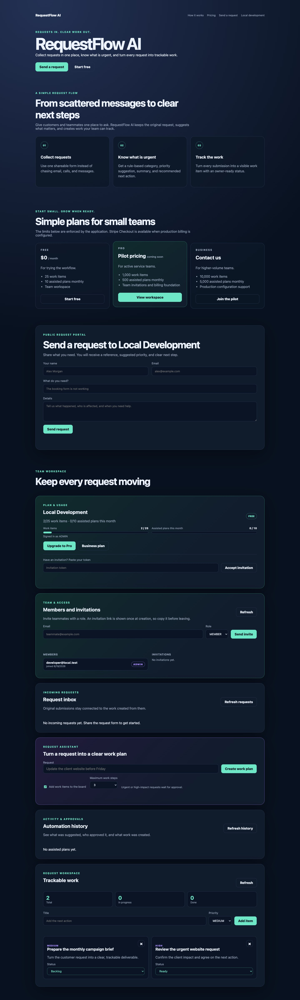
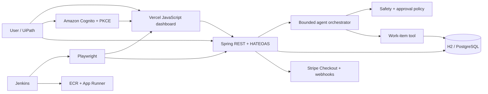

# Automation Mission Control

A production-shaped, multi-tenant SaaS portfolio project connecting REST engineering, browser
automation, security, DevOps, cloud, RPA, and agentic AI. People manage a delivery board while a
bounded planning agent turns goals into attributable, auditable work.


[](https://github.com/jmmmdv/FromZeroToHero/actions/workflows/ci.yml)




> **Reviewing this for a role?** Start with the [case study](docs/portfolio/CASE-STUDY.md) for the
> problem, key engineering decisions, and evidence, then the [demo script](docs/portfolio/DEMO-SCRIPT.md)
> for a five-minute walkthrough.

## Product direction: MissionOps AI

This repository is evolving from Automation Mission Control into **MissionOps AI**, a request
automation product that helps small service businesses turn messy customer or employee requests
into organized, trackable, automation-assisted work with human approval and audit history. The
[commercial MVP contract](docs/product/MISSIONOPS-MVP.md) defines the first paid pilot and keeps raw
service requests separate from internal execution work.

## Why this project exists

Most training repositories are disconnected examples. This one demonstrates how production
concerns interact inside a coherent product:

- signed JWT identity becomes a trusted tenant boundary at the repository layer;
- agent actions create durable audit evidence tied to user, tenant, and correlation ID;
- the same Flyway migrations run against fast local H2 and real PostgreSQL in CI;
- REST, database-consistency, security, contract, and browser tests form one delivery gate;
- organizations, memberships, invitations, plan quotas, and Stripe subscription state form a real SaaS product layer;
- Jenkins, GitHub Actions, Docker, CloudFormation, and operational docs show the path to release.

The rule-based agent is intentionally deterministic. It makes orchestration, safety boundaries,
and evaluation visible before an external LLM is introduced.

## Start here

Requirements: Java 21+, Node.js 20+ (24 recommended), and Git. Docker is optional locally but
enables the real PostgreSQL integration test.

```bash
./mvnw spring-boot:run
```

Open [http://localhost:8080](http://localhost:8080). In another terminal:

- Dashboard: [http://localhost:8080](http://localhost:8080)
- Swagger UI: [http://localhost:8080/swagger-ui.html](http://localhost:8080/swagger-ui.html)
- OpenAPI JSON: [http://localhost:8080/v3/api-docs](http://localhost:8080/v3/api-docs)

The default Vercel deployment is an explicitly labeled, browser-local portfolio preview with
disposable data. When its three public `MISSION_*` variables are configured, the same build becomes
the production UI: Cognito Authorization Code + PKCE in the browser and bearer-token calls to the
App Runner API. See [the SaaS launch guide](docs/saas/SAAS-LAUNCH.md).

```bash
curl http://localhost:8080/api/work-items
curl -X POST http://localhost:8080/api/agent/plan \
  -H 'Content-Type: application/json' \
  -H 'Idempotency-Key: demo-deploy-001' \
  -d '{"goal":"Deploy the REST API to AWS","createWorkItems":true,"toolBudget":3}'
```

Run all automated checks:

```bash
./mvnw clean verify
npm ci
npx playwright install chromium
npm test
```

Run the local observability lab:

```bash
docker compose --profile observability up -d
TRACING_ENABLED=true ./mvnw spring-boot:run
```

Open Grafana at [http://localhost:3000](http://localhost:3000), Prometheus at
[http://localhost:9090](http://localhost:9090), then exercise the dashboard to generate metrics and
traces. Grafana is pre-provisioned with Prometheus, Tempo, and the Mission Control dashboard.

Run only the API–database comparison samples:

```bash
./mvnw -Dtest=ApiDatabaseConsistencyTest test
```

Run against a production-shaped PostgreSQL database:

```bash
docker compose up -d postgres
SPRING_DATASOURCE_URL=jdbc:postgresql://localhost:5432/mission_control \
SPRING_DATASOURCE_USERNAME=mission SPRING_DATASOURCE_PASSWORD=mission \
./mvnw spring-boot:run
```

Flyway owns the schema in every environment, so H2, CI, and PostgreSQL start from the same
reviewed migration. Production credentials belong in `DATABASE_USERNAME` and
`DATABASE_PASSWORD`, never in source control.

## Engineering evidence

| Claim | Evidence in the repository |
|---|---|
| Tenant data cannot cross organization boundaries | `TenantIsolationSecurityTest` proves list and direct-ID isolation |
| API responses agree with persisted rows | `ApiDatabaseConsistencyTest` compares HTTP JSON with raw SQL |
| Migrations work on PostgreSQL | `PostgreSqlApiIntegrationTest` runs Flyway and API persistence in Testcontainers |
| API behavior is discoverable | `/swagger-ui.html`, `/v3/api-docs`, and `OpenApiDocumentationTest` |
| Agent activity is attributable | `agent_run` stores tenant, user, correlation ID, outcome, and timestamp |
| High-impact actions need a person | `AgentPolicyEngine` pauses execution and the approval API is idempotent |
| Agent behavior cannot silently regress | `AgentEvaluationTest` gates 27 golden and adversarial cases in CI |
| Main cannot silently lose coverage | JaCoCo fails `verify` below 80% line coverage |
| User journeys work in a browser | Playwright covers dashboard, agent, status, and REST CRUD workflows |
| Production data stays private and recoverable | CloudFormation provisions private encrypted RDS, Secrets Manager, backups, and snapshot retention |
| Operators can detect and diagnose failure | OTLP tracing, provisioned Grafana, CloudWatch dashboard, SNS alarms, SLOs, and runbooks |
| The product has a SaaS control plane | Organizations, memberships, invitations, plan quotas, Stripe Checkout, and signed webhooks have integration tests |
| Browser credentials are never embedded | Cognito uses a public client, Authorization Code + PKCE, state validation, and deploy-time public configuration |

## Five-minute reviewer walkthrough

1. Start the app and open the dashboard screenshot or live UI.
2. Use Swagger UI to create and update a work item, then inspect its HAL links.
3. Run an urgent production goal, show that zero tools run, then approve it from the audit trail.
4. Open `TenantIsolationSecurityTest` to explain why tenant identity never comes from input data.
5. Open the provisioned Grafana dashboard and follow one request from metrics to a Tempo trace.
6. Run `./mvnw clean verify` and show the PostgreSQL test and JaCoCo report under
   `target/site/jacoco/index.html`.
7. Run `npm test` and inspect the Playwright HTML report.

## What you will learn

| Topic from the course | Where it lives | Practical challenge |
|---|---|---|
| JavaScript | `src/main/resources/static/app.js` | Fetch HAL JSON, update the DOM, handle failures |
| Playwright | `e2e/` and `playwright.config.js` | UI, API, locators, assertions, traces, CI retries |
| API–database testing | `ApiDatabaseConsistencyTest.java` | Compare REST JSON with raw SQL results |
| Git | `docs/git/WORKFLOW.md` | Branch, commit, merge, revert, resolve a conflict |
| Jira | `docs/jira/PROJECT-SETUP.md`, issue templates | Turn a requirement into epic → story → task → bug |
| Agile | `docs/agile/PLAYBOOK.md` | Plan a sprint, define done, demo, retrospect |
| SDLC | `docs/sdlc/SDLC.md` | Trace an idea through design, build, test, release, operate |
| Jenkins | `Jenkinsfile` | Build, unit test, E2E test, package, archive evidence |
| AWS | `infrastructure/aws/` | Containerize, push to ECR, deploy App Runner via CloudFormation |
| UiPath | `docs/uipath/INTEGRATION-LAB.md` | Let an RPA workflow call the REST API without scraping the UI |
| AI agents | `agent/AgentOrchestrator.java` | Classify, enforce policy and budgets, invoke typed tools, audit every outcome |
| Agentic AI | `docs/architecture/AGENTIC-AI.md` | Add guardrails, idempotency, approval, memory, evaluation |
| SaaS security | `docs/security/PRODUCTION-SECURITY.md` | JWT roles, trusted tenant context, isolation tests, audit trail |
| Intelligent automation | Full system | Combine API, rules, browser automation, RPA, CI, and cloud |
| Real-world projects | Milestones below | Deliver vertical slices with acceptance evidence |
| Spring REST | `workitem/`, tests, HATEOAS | CRUD, validation, RFC 9457-style problems, links, persistence |

The Spring implementation is based on the official
[Building REST services with Spring](https://spring.io/guides/tutorials/rest/) tutorial, then
extended with validation, `201 Created` locations, Problem Details, service tests, and a UI.

## Architecture



The agent is rule-based on purpose: learners can see orchestration and tool use without paying
for a model or leaking data. The extension path in `docs/architecture/AGENTIC-AI.md` shows where
an LLM belongs while keeping deterministic tests and safety controls.

## API tour

| Method | Path | Purpose |
|---|---|---|
| `GET` | `/api/work-items` | HAL collection with navigable links |
| `POST` | `/api/work-items` | Validate and create; returns `201` and `Location` |
| `GET` | `/api/work-items/{id}` | Read one or return a structured `404` |
| `PUT` | `/api/work-items/{id}` | Replace mutable fields |
| `PATCH` | `/api/work-items/{id}/status` | Change status without replacing the item |
| `DELETE` | `/api/work-items/{id}` | Delete and return `204` |
| `POST` | `/api/agent/plan` | Dry-run or execute an auditable three-step plan |
| `POST` | `/api/agent/runs/{id}/approve` | Approve one pending high-impact plan; safe to retry |
| `GET` | `/api/agent/runs` | Tenant-scoped agent audit history (production: admin only) |
| `GET` | `/api/saas/organization` | Organization, role, subscription, and quota usage |
| `PATCH` | `/api/saas/organization` | Rename an organization (admin only) |
| `GET/POST` | `/api/saas/invitations` | List or issue expiring team invitations (admin only) |
| `POST` | `/api/saas/invitations/accept` | Accept an email-bound, one-time invitation |
| `POST` | `/api/billing/checkout` | Create idempotent Stripe Checkout for PRO or BUSINESS |
| `POST` | `/api/billing/webhook` | Verify Stripe HMAC and synchronize subscription state |
| `GET` | `/actuator/health` | CI/cloud health probe |

## Learning milestones

1. **Explorer:** run the service, use browser DevTools, change one JavaScript component.
2. **API builder:** add assignee and due-date fields through entity, validation, API, and tests.
3. **Quality engineer:** add Playwright edit/delete cases and diagnose a trace from a forced failure.
4. **Delivery engineer:** run the Jenkins pipeline and deploy an immutable image to AWS.
5. **Automation engineer:** complete the UiPath API workflow with retry and business exceptions.
6. **Agent engineer (complete):** typed planner seam, human approval, execution budget,
   tenant-scoped idempotency, audit UI, and a 27-case evaluation gate.
7. **Capstone (in progress):** run PostgreSQL in production, secure every tenant, add
   observability, and operate the service against measurable reliability targets.

   - [x] Flyway migrations, PostgreSQL driver, and production database profile
   - [x] OAuth2 JWT authentication with role-based authorization
   - [x] Tenant-scoped persistence with tested cross-tenant isolation
   - [x] Attributed agent audit records and correlation IDs
   - [x] Private RDS, VPC connectivity, and Secrets Manager integration in AWS
   - [x] OpenTelemetry tracing, local Grafana, CloudWatch dashboard, and actionable alarms
   - [x] SLOs, incident runbook, backup policy, and repeatable restore-drill procedure
   - [ ] Execute and record the restore drill in an AWS sandbox account
   - [x] Browser authorization-code flow with PKCE for the production UI
   - [x] Organization onboarding, memberships, roles, and expiring invitations
   - [x] Enforced FREE/PRO/BUSINESS work-item and monthly agent-run quotas
   - [x] Stripe Checkout plus timestamped, constant-time verified webhook synchronization
   - [ ] Execute a real Cognito signup, Stripe test checkout, and invitation identity-transfer drill

Each milestone is done only when code, tests, documentation, and demo evidence agree.

## Repository conventions

- Never commit secrets. Use environment variables and a secret manager.
- API changes require unit/integration tests and updated docs.
- Browser tests assert user-visible behavior, not implementation details.
- Agent actions must be bounded, observable, and safe to repeat.
- Tenant identity comes only from a verified JWT claim; never trust a client-supplied tenant ID.
- Cloud resources are declared as code and reviewed before deployment.

This repository is intentionally ready for your first commit, but no commit is made for you—you
should practice the Git workflow yourself.
