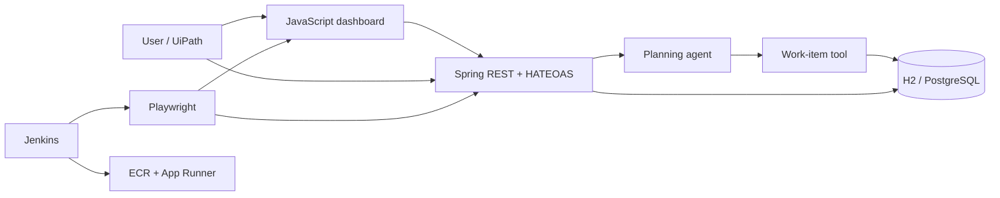

# Automation Mission Control

A production-shaped learning project that connects software development, test automation,
DevOps, cloud, RPA, and agentic AI. Instead of isolated “hello world” samples, every topic
contributes to one application: a mission board where people and an automation agent plan work.


## Start here

Requirements: Java 21+, Node.js 20+ (24 recommended), and Git.

```bash
./mvnw spring-boot:run
```

Open [http://localhost:8080](http://localhost:8080). In another terminal:

```bash
curl http://localhost:8080/api/work-items
curl -X POST http://localhost:8080/api/agent/plan \
  -H 'Content-Type: application/json' \
  -d '{"goal":"Deploy the REST API to AWS","createWorkItems":true}'
```

Run all automated checks:

```bash
./mvnw clean verify
npm ci
npx playwright install chromium
npm test
```

Run only the API–database comparison samples:

```bash
./mvnw -Dtest=ApiDatabaseConsistencyTest test
```

Run against a production-shaped PostgreSQL database:

```bash
docker compose up -d postgres
SPRING_PROFILES_ACTIVE=prod ./mvnw spring-boot:run
```

Flyway owns the schema in every environment, so H2, CI, and PostgreSQL start from the same
reviewed migration. Production credentials belong in `DATABASE_USERNAME` and
`DATABASE_PASSWORD`, never in source control.

## What you will learn

| Topic from the course | Where it lives | Practical challenge |
|---|---|---|
| JavaScript | `src/main/resources/static/app.js` | Fetch HAL JSON, update the DOM, handle failures |
| Playwright | `e2e/` and `playwright.config.js` | UI, API, locators, assertions, traces, CI retries |
| API–database testing | `ApiDatabaseConsistencyTest.java` | Compare REST JSON with raw SQL results |
| Git | `docs/git/WORKFLOW.md` | Branch, commit, merge, revert, resolve a conflict |
| Jira | `docs/jira/PROJECT-SETUP.md`, issue templates | Turn a requirement into epic → story → task → bug |
| Agile | `docs/agile/PLAYBOOK.md` | Plan a sprint, define done, demo, retrospect |
| SDLC | `docs/sdlc/SDLC.md` | Trace an idea through design, build, test, release, operate |
| Jenkins | `Jenkinsfile` | Build, unit test, E2E test, package, archive evidence |
| AWS | `infrastructure/aws/` | Containerize, push to ECR, deploy App Runner via CloudFormation |
| UiPath | `docs/uipath/INTEGRATION-LAB.md` | Let an RPA workflow call the REST API without scraping the UI |
| AI agents | `agent/PlanningAgent.java` | Classify a goal, create a plan, invoke a tool, return an audit trail |
| Agentic AI | `docs/architecture/AGENTIC-AI.md` | Add guardrails, idempotency, approval, memory, evaluation |
| SaaS security | `docs/security/PRODUCTION-SECURITY.md` | JWT roles, trusted tenant context, isolation tests, audit trail |
| Intelligent automation | Full system | Combine API, rules, browser automation, RPA, CI, and cloud |
| Real-world projects | Milestones below | Deliver vertical slices with acceptance evidence |
| Spring REST | `workitem/`, tests, HATEOAS | CRUD, validation, RFC 9457-style problems, links, persistence |

The Spring implementation is based on the official
[Building REST services with Spring](https://spring.io/guides/tutorials/rest/) tutorial, then
extended with validation, `201 Created` locations, Problem Details, service tests, and a UI.

## Architecture



The agent is rule-based on purpose: learners can see orchestration and tool use without paying
for a model or leaking data. The extension path in `docs/architecture/AGENTIC-AI.md` shows where
an LLM belongs while keeping deterministic tests and safety controls.

## API tour

| Method | Path | Purpose |
|---|---|---|
| `GET` | `/api/work-items` | HAL collection with navigable links |
| `POST` | `/api/work-items` | Validate and create; returns `201` and `Location` |
| `GET` | `/api/work-items/{id}` | Read one or return a structured `404` |
| `PUT` | `/api/work-items/{id}` | Replace mutable fields |
| `PATCH` | `/api/work-items/{id}/status` | Change status without replacing the item |
| `DELETE` | `/api/work-items/{id}` | Delete and return `204` |
| `POST` | `/api/agent/plan` | Dry-run or execute an auditable three-step plan |
| `GET` | `/api/agent/runs` | Tenant-scoped agent audit history (production: admin only) |
| `GET` | `/actuator/health` | CI/cloud health probe |

## Learning milestones

1. **Explorer:** run the service, use browser DevTools, change one JavaScript component.
2. **API builder:** add assignee and due-date fields through entity, validation, API, and tests.
3. **Quality engineer:** add Playwright edit/delete cases and diagnose a trace from a forced failure.
4. **Delivery engineer:** run the Jenkins pipeline and deploy an immutable image to AWS.
5. **Automation engineer:** complete the UiPath API workflow with retry and business exceptions.
6. **Agent engineer:** add a new tool, approval policy, execution budget, and evaluation dataset.
7. **Capstone (in progress):** run PostgreSQL in production, secure every tenant, add
   observability, and operate the service against measurable reliability targets.

   - [x] Flyway migrations, PostgreSQL driver, and production database profile
   - [x] OAuth2 JWT authentication with role-based authorization
   - [x] Tenant-scoped persistence with tested cross-tenant isolation
   - [x] Attributed agent audit records and correlation IDs
   - [ ] Private RDS, VPC connectivity, and Secrets Manager integration in AWS
   - [ ] Distributed tracing, service dashboards, and actionable alerts
   - [ ] SLOs, incident runbooks, backup policy, and tested restore drill
   - [ ] Browser authorization-code flow with PKCE for the production UI

Each milestone is done only when code, tests, documentation, and demo evidence agree.

## Repository conventions

- Never commit secrets. Use environment variables and a secret manager.
- API changes require unit/integration tests and updated docs.
- Browser tests assert user-visible behavior, not implementation details.
- Agent actions must be bounded, observable, and safe to repeat.
- Tenant identity comes only from a verified JWT claim; never trust a client-supplied tenant ID.
- Cloud resources are declared as code and reviewed before deployment.

This repository is intentionally ready for your first commit, but no commit is made for you—you
should practice the Git workflow yourself.
