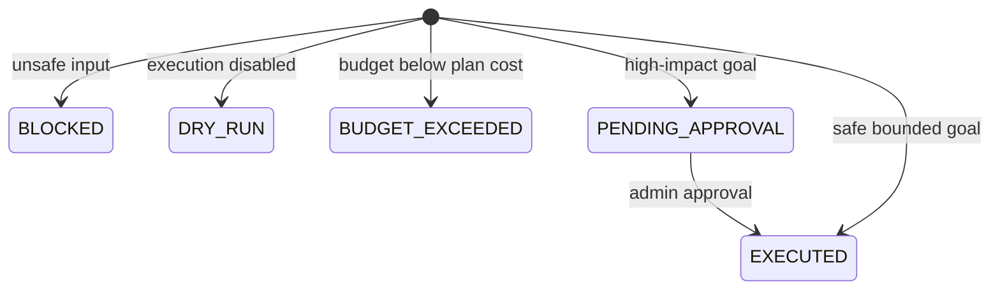

# Agentic AI: from demo to dependable system

The current `AgentOrchestrator` demonstrates dependable mechanics without an external model:

1. **Observe:** validate and normalize a goal.
2. **Reason:** classify it through the replaceable `GoalPlanner` seam.
3. **Plan:** decompose it into discover, implement, verify.
4. **Govern:** block unsafe input, enforce a three-call budget, and pause high-impact work.
5. **Act:** invoke typed work-item operations—or perform a dry run.
6. **Report:** persist tenant, user, correlation, idempotency key, outcome, and created IDs.

This is agentic because software selects and executes actions toward a goal. It is intentionally not
presented as magical intelligence: the policy is narrow, inspectable, and thoroughly testable.

## Implemented safety lifecycle

The `Idempotency-Key` is unique per tenant. Repeating a plan or approval returns the original
result rather than creating duplicate work. A database constraint is the final concurrency guard;
the approval path also takes a pessimistic row lock.

`AgentEvaluationTest` reads `agent-evaluation.csv`: 27 representative, high-impact, and adversarial
goals must keep the expected classification and safety outcome on every CI run.

## LLM extension seam

Keep `RuleBasedGoalPlanner` as fallback and add an LLM-backed `GoalPlanner` implementation that
returns a schema-validated plan. Do not give a model direct database
or shell access; expose allow-listed, typed tools through an orchestrator that enforces:

- maximum steps, elapsed time, and cost;
- input/output schema validation and content limits;
- authorization in the tool layer, not the prompt;
- human approval for deletion, deployment, messages, or expensive actions;
- idempotency keys, transaction boundaries, and compensation;
- correlation IDs and audit events without secrets or hidden chain-of-thought;
- model/prompt versioning, evaluation datasets, and rollback.

The next evaluation layer should score plan relevance, latency, cost, and human acceptance while
retaining the existing zero-tolerance gates for unsafe or duplicate actions.
