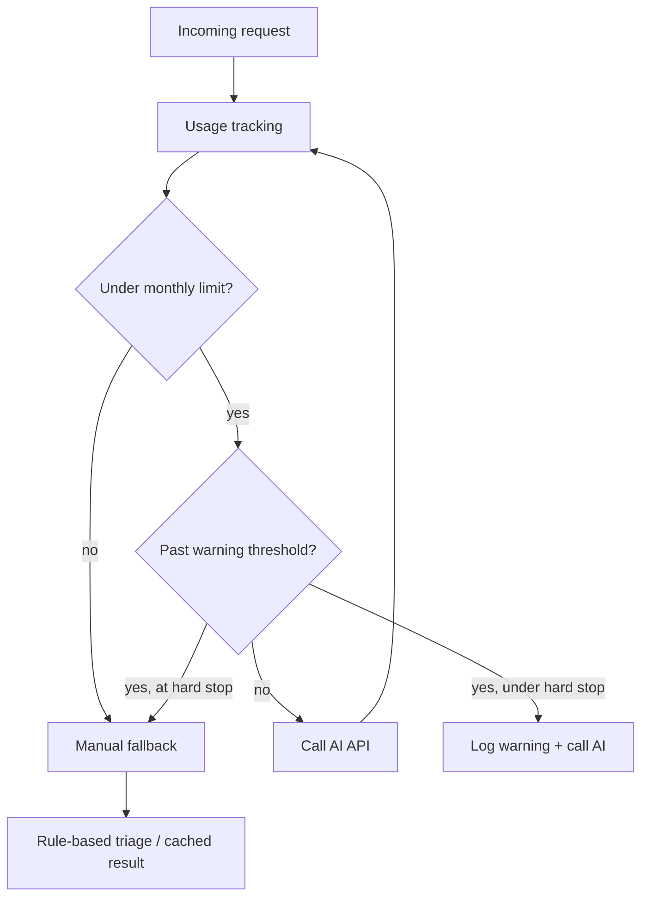

# API cost guardrails

Production-minded rules for controlling OpenAI and other AI/API spend at RequestFlowAI.

**Related docs:** [BUDGET.md](../finance/BUDGET.md) · [PRICING.md](../finance/PRICING.md) ·
[UNIT_ECONOMICS.md](../finance/UNIT_ECONOMICS.md) · [FINANCE_CHECKLIST.md](../finance/FINANCE_CHECKLIST.md) ·
[PRODUCTION-SECURITY.md](PRODUCTION-SECURITY.md)

---

## 1. Purpose

AI-assisted request analysis is a core product differentiator, but it is also a **variable cost**
that scales with usage. Before revenue and during MVP validation, uncontrolled API spend can exceed
the entire monthly infrastructure budget in days.

These guardrails define how RequestFlowAI keeps AI analysis **valuable, predictable, and financially
safe**. They apply to OpenAI and any future model providers the same way.

**Today:** classification and priority in the MVP are largely **rule-based**. When LLM analysis is
enabled, these rules become mandatory — not optional polish.

---

## 2. Core cost-control rules

| Rule | Requirement |
|---|---|
| No unlimited AI | Every environment and plan must enforce finite analysis quotas. |
| Plan limits | Every pricing plan includes **request limits** and **AI analysis limits** (see [PRICING.md](../finance/PRICING.md)). |
| Persist results | Store analysis output on the request/work item so the same request is **not** re-analyzed on refresh, retry, or duplicate webhook delivery. |
| Fallback path | When quota or budget is exhausted, use **rule-based or manual analysis** — never fail open into unlimited API calls. |
| Cost per request | Track estimated variable cost per analyzed request for margin review. |
| Cost per customer | Roll up usage and estimated spend **per organization (tenant)** monthly. |
| Monthly cap | Set a **global** OpenAI/API spending limit in the provider dashboard and in application config. |
| Early warning | Alert operators when spend reaches **70%** of the monthly cap — before the hard stop. |
| No keys in browser | API keys stay **server-side only**; the frontend never calls OpenAI directly. |
| No secrets in git | Never commit API keys, `.env` files, or credential JSON to GitHub. Use env vars and a secret manager in production. |

---

## 3. MVP limits

Recommended defaults for pre-revenue and MVP validation:

| Control | Value |
|---|---|
| Global monthly OpenAI budget | **USD 50** |
| Warning threshold | **70%** of budget (USD 35) — operator alert |
| Hard stop threshold | **90%** of budget (USD 45) — block new AI calls |
| After hard stop | **Manual review mode** — new analyses require founder approval or rule-based fallback only |
| Failed AI calls | **No automatic retry loops** — log, fallback once, do not hammer the API |

**Provider dashboard:** Set OpenAI (or vendor) **hard monthly limit** to match or slightly below USD 50
until paying customers justify an increase.

**Application behavior at hard stop:**

1. Reject or queue new AI analysis requests with a clear tenant-safe message.
2. Serve cached or rule-based triage for intake that already has stored analysis.
3. Record the event in usage logs for CFO review.

### Spend control pipeline (five layers)

These layers run in order on every AI analysis attempt:

| Layer | What it does | MVP default | Where enforced |
|---|---|---|---|
| **Usage tracking** | Record per-tenant and global `estimatedCostUsd`, tokens, and analysis count for the calendar month | Log + DB row per analysis (when LLM ships) | App DB + structured logs |
| **Monthly limit** | Global cap on estimated API spend for the current month | **USD 50** | OpenAI dashboard + app config |
| **Warning threshold** | Operator alert before budget is exhausted; AI still allowed | **70%** (USD 35) | Log line + optional email/SNS |
| **Hard stop** | Block **new** AI API calls; do not retry in a loop | **90%** (USD 45) | Server-side gate before provider call |
| **Manual fallback** | Serve rule-based classification, cached analysis, or queue for founder review — intake still succeeds | `RuleBasedRequestClassifier` today | Same path as quota exhaustion |

**Enforcement order:**

1. **Usage tracking** — increment counters only after a successful AI call (or on estimated pre-flight for budgeting).
2. **Monthly limit** — compare rolling month `sum(estimatedCostUsd)` to cap.
3. **Warning threshold** — at 70%, emit `AI_BUDGET_WARNING` once per month (metadata only, no secrets).
4. **Hard stop** — at 90%, set `aiBudgetExhausted=true` for the month; skip provider calls.
5. **Manual fallback** — never leave the customer without triage; use rules already in production.

**Today (no OpenAI in production path):** layers 1–4 are **documentation + provider dashboard** only; layer 5 (**manual fallback**) is **live** via `RuleBasedRequestClassifier` on every intake.

---

## 4. SaaS plan guardrails

Each commercial plan must map API entitlement to price. Limits protect gross margin; automation
features justify higher tiers.

| Plan | Request guardrail | AI analysis guardrail | Notes |
|---|---|---|---|
| **Starter** | Small monthly request cap | Low AI analysis cap | Solo / micro teams; mostly rule-based OK |
| **Growth** | Medium request cap | Medium AI cap | Default paid pilot tier |
| **Business** | High request cap | High AI cap | Automation workflows add value, not raw token burn |
| **Custom / Pilot** | Manually set per contract | Manually set per contract | Document limits in pilot SOW; reset at pilot end |

**Enforcement order (when implemented):**

1. Check organization plan quota (requests + analyses).
2. Check global monthly budget remaining.
3. Call AI only if both pass; otherwise fallback.

Align numeric limits with [PRICING.md](../finance/PRICING.md) and Stripe entitlements.

---

## 5. Engineering rules

| Rule | Detail |
|---|---|
| Server-side only | All AI/API calls run in the Spring Boot backend — never from static JS or Vercel build. |
| Secrets via environment | `OPENAI_API_KEY` (or equivalent) from env / Secrets Manager — not `application.properties` in git. |
| Validate before send | Reject empty, oversized, or malformed payloads before calling the model. |
| Input length cap | Truncate or reject request body text above a defined character/token ceiling (document the limit in code when implemented). |
| Log metadata, not secrets | Log `requestId`, `tenantId`, token estimates, model name — never log prompts containing PII bundles or API keys. |
| Rate limiting | Public intake already has rate limits in production; add **per-tenant AI rate limits** before broad LLM rollout. |
| Customer usage tracking | Persist per-organization monthly counters (`aiAnalysisUsed`, `estimatedCostUsd`) before enabling paid AI tiers. |

**Idempotency:** Intake and agent flows already use idempotency keys; AI analysis must respect the
same request identity so retries do not double-charge.

**Non-blocking intake:** Email and notification failures must not block request creation; AI budget
exhaustion should behave the same way — degrade to rule-based, do not drop the customer request.

---

## 6. Example usage fields

When implementing usage persistence, prefer tenant-scoped rows. Example fields:

| Field | Type | Purpose |
|---|---|---|
| `customerId` | UUID / string | Organization or Stripe customer id |
| `requestId` | UUID | Links usage to a specific intake or work item |
| `aiAnalysisUsed` | boolean or count | Whether this event consumed an analysis credit |
| `estimatedTokens` | integer | Prompt + completion token estimate |
| `estimatedCostUsd` | decimal | `estimatedTokens × model rate` at time of call |
| `modelName` | string | e.g. `gpt-4o-mini` for audit and cost tuning |
| `createdAt` | timestamp | Monthly rollup and invoice reconciliation |

Store aggregates monthly per `customerId` for plan enforcement and CFO reporting.

---

## 7. CFO decision

**RequestFlowAI should only increase AI/API spending after customer demand, pricing, and gross
margin are validated.**

Raise the global monthly budget only when **all** are true:

1. At least one paying customer on a plan that includes AI analysis.
2. [UNIT_ECONOMICS.md](../finance/UNIT_ECONOMICS.md) shows **≥ 50% gross margin** at actual usage.
3. Per-tenant quotas and usage tracking are live — not spreadsheet guesses.
4. OpenAI invoice for the prior month was reviewed and matched internal estimates within **20%**.

Until then, keep the MVP cap at **USD 50**, use rule-based triage as default, and treat every AI
call as a paid experiment.

---

## Implementation status

### Step 1 — Budget configuration and service (implemented)

| Component | Location | Notes |
|---|---|---|
| `AiBudgetProperties` | `src/main/java/.../ai/budget/AiBudgetProperties.java` | `requestflow.ai.budget.*` defaults in `application.properties` |
| `AiBudgetService` | `src/main/java/.../ai/budget/AiBudgetService.java` | Warning (70%), hard stop (90%), `canUsePaidAi`, `manualReviewRequired` |
| `AiBudgetStatus` | `src/main/java/.../ai/budget/AiBudgetStatus.java` | Immutable status record for callers |

**Not yet wired:** intake classification, OpenAI client, or live spend feeds into analysis paths.
**No paid API calls** are made by this step — rule-based analysis is unchanged.

**Next steps:** per-tenant quotas, `RequestAnalysisService` facade before any OpenAI integration.

### Step 2 — AI usage event persistence (implemented)

| Component | Location | Notes |
|---|---|---|
| Flyway `V9__add_ai_usage_events.sql` | `ai_usage_event` table | Tenant-scoped metadata, cost, tokens, budget snapshot |
| `AiUsageEvent` | `src/main/java/.../ai/usage/AiUsageEvent.java` | JPA entity |
| `AiUsageEventRepository` | `src/main/java/.../ai/usage/AiUsageEventRepository.java` | Monthly sum, tenant count, recent events |
| `AiUsageEventService` | `src/main/java/.../ai/usage/AiUsageEventService.java` | `record()`, monthly rollups; integrates `AiBudgetService` for snapshot |

**Still not wired:** `RequestIntakeService` and `AgentOrchestrator` do not call `AiUsageEventService` yet.
**Still no OpenAI SDK, API keys, or paid API calls.**

**Step 3 target:** record rule-based intake events from `RequestIntakeService.submit()` and gate future
LLM calls through a `RequestAnalysisService` facade.

### Step 3 — Rule-based intake usage recording (implemented)

| Component | Location | Notes |
|---|---|---|
| `recordPublicIntakeClassificationSafely()` | `AiUsageEventService` | Called from `RequestIntakeService.submit()` after save; failures logged, never block intake |
| `V10__extend_ai_usage_event_enums.sql` | Flyway | Adds `PUBLIC_INTAKE_CLASSIFICATION` and `NOT_PAID_AI` |

**Idempotency:** usage events are recorded only on the new-submission path — idempotent replays return
before `recordPublicIntakeClassificationSafely()` is called.

**Still no OpenAI SDK, API keys, or paid API calls.** Classification logic is unchanged.

### Step 4 — SaaS plan monthly AI analysis limits (implemented)

| Component | Location | Notes |
|---|---|---|
| `Plan.monthlyAiAnalysisLimit()` | `Plan.java` | FREE 25 · PRO 1,000 · BUSINESS 10,000 |
| `AiAnalysisQuotaService` | `ai/usage/AiAnalysisQuotaService.java` | Monthly count, quota status, `assertAiAnalysisCapacity()` |
| `AiAnalysisQuotaStatus` | `ai/usage/AiAnalysisQuotaStatus.java` | Used/limit/under/exceeded snapshot |
| Repository count | `AiUsageEventRepository.countMonthlyAiAnalysesByTenantSince` | Distinct `requestId` (or `id`) per month |

Usage is counted from `ai_usage_event` analysis operations (`PUBLIC_INTAKE_CLASSIFICATION`,
`REQUEST_ANALYSIS`, `AGENT_ANALYSIS`). Duplicate `requestId` rows in the same month count once.

**Not enforced on public intake yet** — service and limits are ready for Step 5 / future LLM gating.
**Still no OpenAI integration or paid API calls.**
